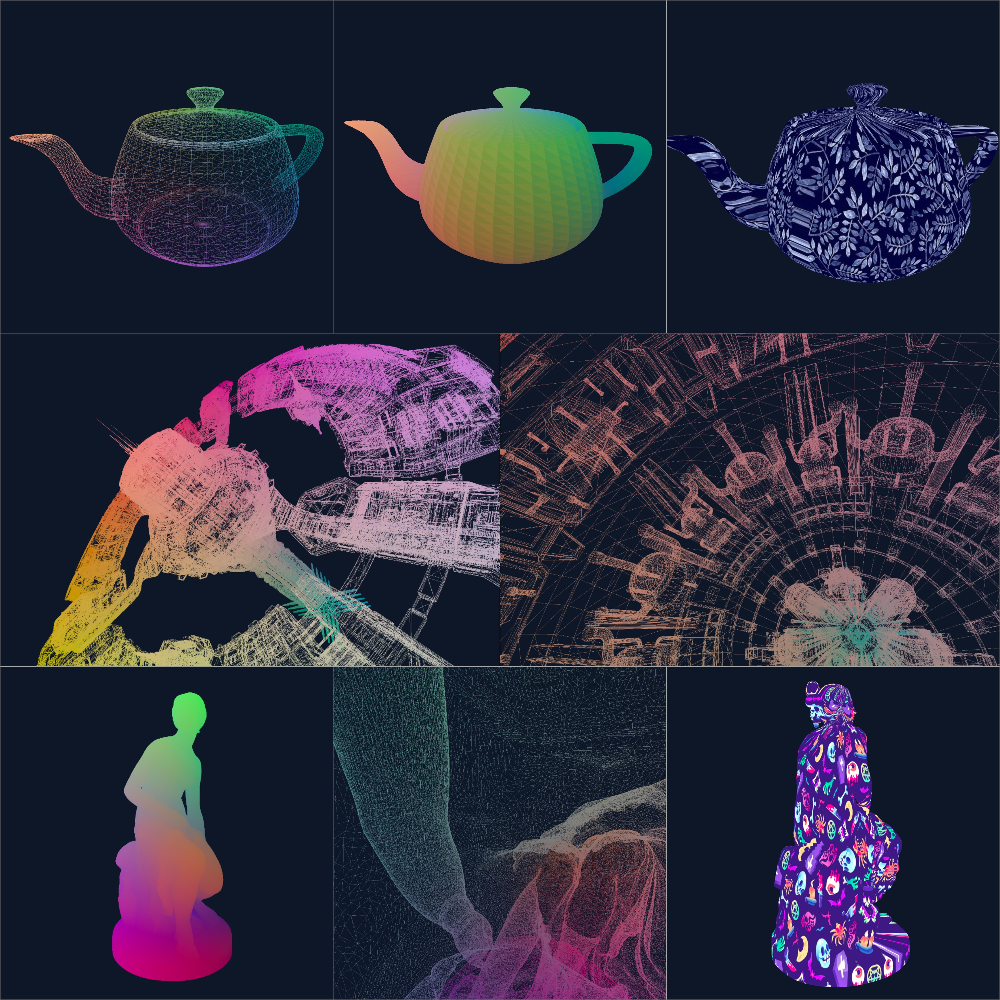
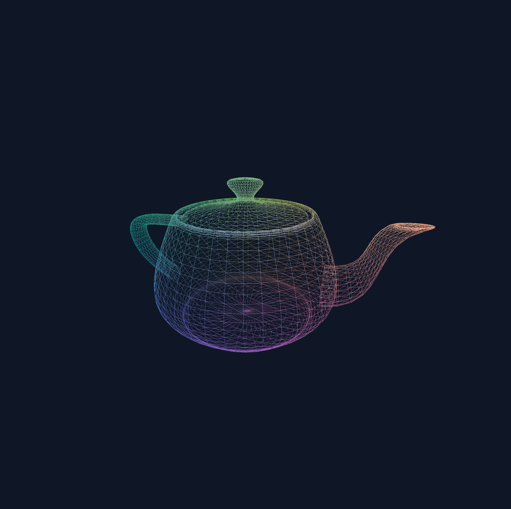

# OpenGL Obj File Renderer

A basic OpenGL .obj file interperter written in C.

This is an introductory project to the world of OpenGL.

All .obj files are downloaded from the internet under Creative Commons Licence, copyright belong to thrie original creators.

## Features
* Switch between 3 modes with keyboard '1':

  #1 Color (flat with different RGB values on each surface)
  
  #2 Grayscale
  
  #3 Texture
* Soft transition between modes enabled by shaders code
* '[' and ']' keys to switch between wireframe and color mode
* Space key to pause and resume rotation along the center verticle axis of the object
* Arrow keys to translate view along x and y-axis
* '+' and '-' keys to translate view along z-axis
* 'WASD' keys to rotate camera along x and z-axis
* Perspective projection

## Compiling and running
Run `make`. An executable will compile. Currently only tested on OS X.

Run with `./scop [file.obj] [texture.bmp]`.
A collection of sample obj and texture files can be found in `/obj` and `\tex` folders, respectively.

